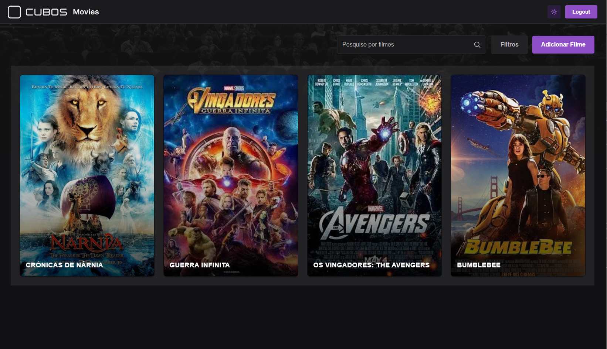
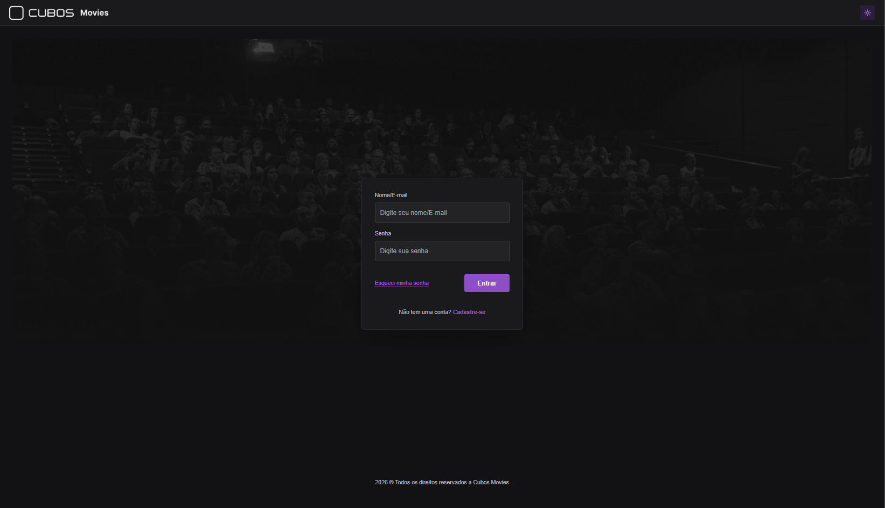
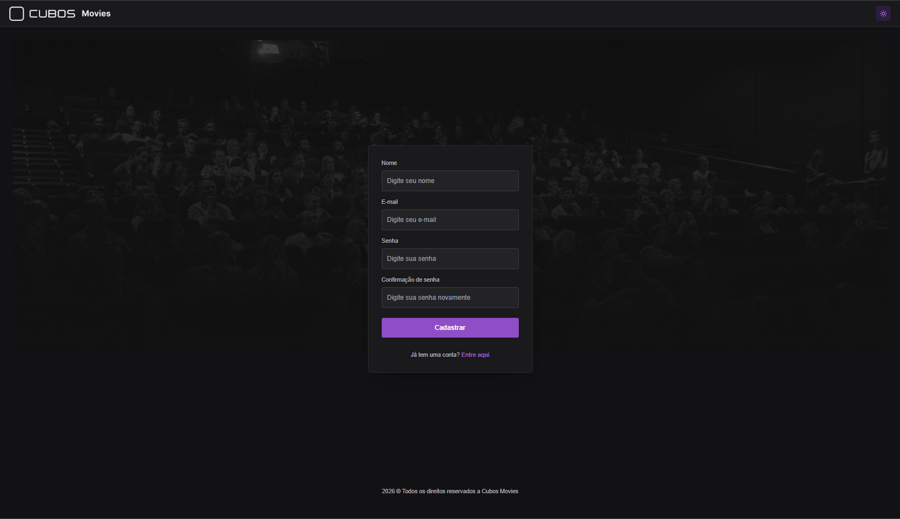
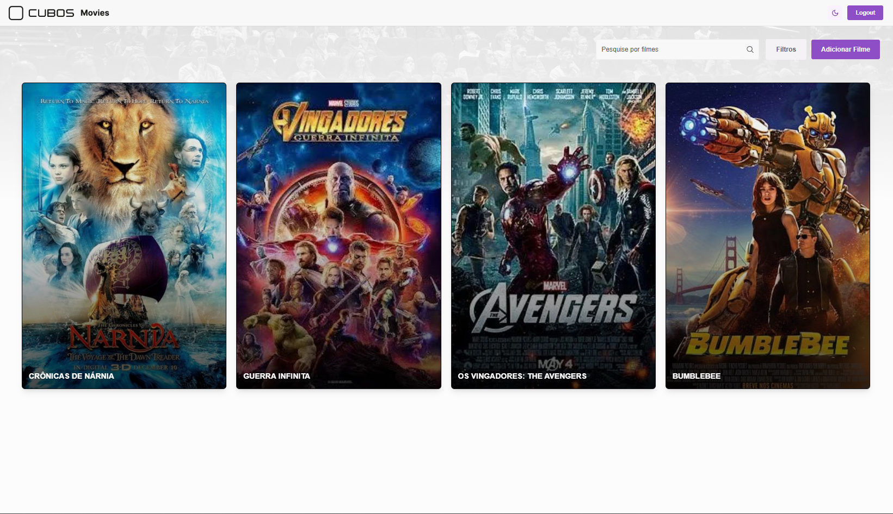
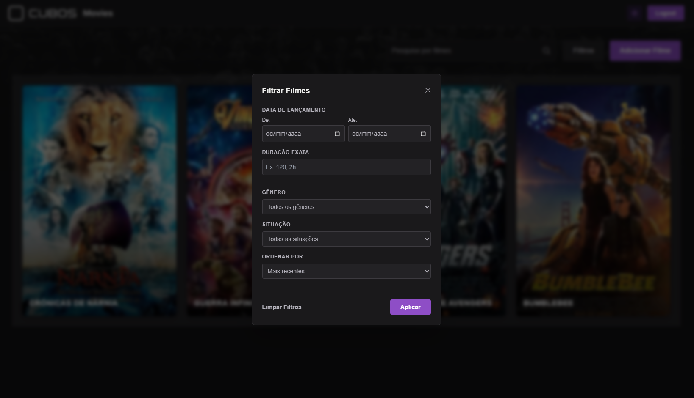
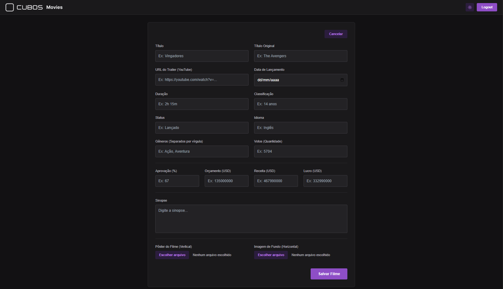
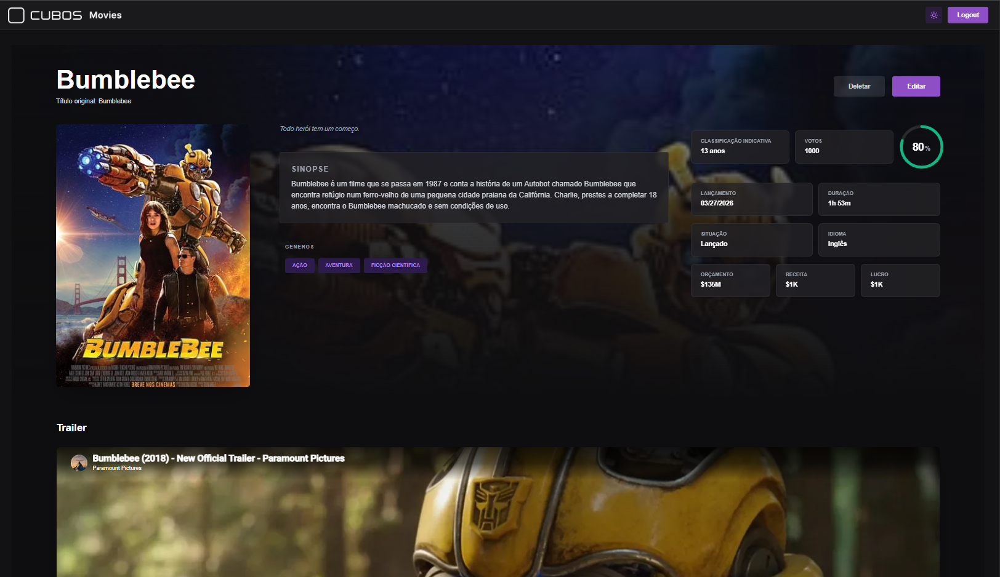

# 🎬 Cubos Movies - Desafio Fullstack



Uma aplicação web completa (Fullstack) para gerenciamento de catálogo de filmes,
com autenticação, listagem, filtros dinâmicos, tema claro/escuro e envio de
e-mails agendados.

Este projeto foi desenvolvido como submissão para o **Desafio Fullstack da
Cubos Tecnologia**.

---

## 📸 Galeria de Telas

<p align="center">
  
  
</p>

<p align="center">
  
  
</p>

<p align="center">
  
  
</p>

<p align="center">
  
</p>

---

## 🏗️ Arquitetura e Ordem de Construção

A arquitetura do projeto mantém separação clara de responsabilidades — um
frontend SPA consumindo uma API RESTful independente. A ordem de construção
seguiu um fluxo lógico de dependências:

1. **Banco de Dados & Schema:** A base de tudo. Sem o schema, não há tipos
   no backend.
2. **Autenticação:** Veio antes do CRUD porque todas as rotas precisam ser
   protegidas desde o início.
3. **CRUD & Filas (Backend):** Rotas da API e integração com Redis/BullMQ.
4. **Frontend:** Iniciado após a API estar estável, garantindo integrações
   tipadas e sem retrabalho.

---

## 🧠 Justificativas da Stack e Decisões de Design

### 💻 Frontend

- **React + Vite:** O Create React App foi oficialmente descontinuado. O Vite
  oferece um _dev server_ ordens de magnitude mais rápido.
- **TanStack Query:** Cache automático, _refetch_ inteligente e gestão nativa
  de estados _loading/error_ sem boilerplate.
- **React Hook Form + Zod:** O Hook Form evita re-renderizações desnecessárias;
  o Zod valida os dados e gera tipagem TypeScript de ponta a ponta.
- **Radix UI:** Escolha natural dado o uso de _Radix Colors_ exigido pelo
  desafio. Os primitivos são _headless_ (sem estilo forçado) e acessíveis por
  padrão (WAI-ARIA).

#### Por que React SPA e não Next.js?

O desafio exige um backend dedicado (Fastify). O Next.js brilha quando atua
como backend via API Routes ou Server Actions — usar os dois criaria duas
"camadas de servidor" sem benefício real.

Além disso, toda a aplicação está protegida por login. Páginas restritas a
usuários autenticados não têm robôs de busca para indexar, tornando o SSR
irrelevante neste cenário.

#### Modificação: Modal de Filtros em vez de Dropdown

O requisito 3.3.1 especifica explicitamente que o botão "Filtro" deve abrir
uma **modal**. A implementação utiliza um overlay com `position: fixed`,
backdrop semitransparente, botão de fechar (✕) e fechamento ao clicar fora
do painel — comportamento semanticamente correto para uma modal e melhor do
ponto de vista de acessibilidade e UX em dispositivos móveis.

### ⚙️ Backend

- **Fastify:** 2 a 3× mais rápido que o Express, com suporte nativo ao
  TypeScript e validação de schemas integrada.
- **Prisma (ORM):** Gera tipos TypeScript automaticamente a partir do schema.
  Nenhuma query retorna `any`.
- **BullMQ + Redis:** Solução robusta para o requisito de e-mail agendado na
  data de estreia. Usar `setTimeout` em memória falharia silenciosamente em
  qualquer reinício do servidor.
- **Cloudflare R2:** Armazenamento de imagens com _free tier_ generoso e API
  100% compatível com Amazon S3.

---

## 🚀 Como Compilar e Executar o Projeto

### Pré-requisitos

- Node.js v18 ou superior
- npm v8 ou superior
- Docker e Docker Compose

### Passo 1: Clonar e instalar dependências

Na raiz do repositório, instale as dependências de todas as workspaces de
uma só vez:

```bash
npm install
```

### Passo 2: Infraestrutura (PostgreSQL e Redis)

```bash
docker-compose up -d
```

### Passo 3: Configurar o Backend

```bash
cd apps/backend
cp .env.example .env
```

Abra o `.env` e preencha as variáveis:

| Variável                    | Descrição                                                       |
| --------------------------- | --------------------------------------------------------------- |
| `DATABASE_URL`              | String de conexão do PostgreSQL (já aponta para o Docker local) |
| `JWT_SECRET`                | Chave secreta para assinar os tokens JWT                        |
| `CLOUDFLARE_*`              | Credenciais do bucket R2 para upload de imagens                 |
| `REDIS_HOST` / `REDIS_PORT` | Endereço do Redis (padrão: `localhost:6379`)                    |
| `RESEND_API_KEY`            | Chave da API do Resend para envio de e-mails                    |

Aplique as migrations do banco de dados:

```bash
npx prisma migrate dev
```

Inicie o servidor:

```bash
npm run dev
```

> O backend estará disponível em `http://localhost:3333`

### Passo 4: Configurar o Frontend

Em um novo terminal:

```bash
cd apps/frontend
npm run dev
```

> Nenhuma variável de ambiente é obrigatória. Por padrão, o frontend aponta
> para `http://localhost:3333`. Caso queira sobrescrever, crie um `.env`
> com `VITE_API_URL=<sua-url>`.

> Acesse a aplicação em `http://localhost:5173`
